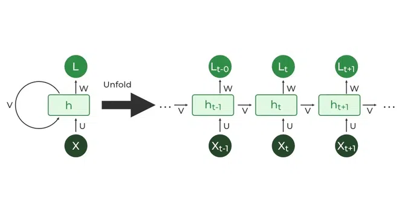

# Sarcastic Detection in Headline News Using Deep Learning Model LSTM
## Problem Statement
In today's digital age, distinguishing between sincere news headlines and those laden with sarcasm can be quite challenging. Imagine, for instance, mistaking a sarcastic headline for a legitimate news article or, worse yet, a hoax. It's disconcerting to learn that some organizations combat this issue by employing a sizable workforce of 250 individuals working in three shifts, tirelessly sifting through online news to determine whether a story is a hoax or not. This approach appears antiquated and inefficient in an era marked by digitization.

In reality, a well-structured team comprising data engineers, data scientists/machine learning engineers, and backend engineers—comprising perhaps 10 to 20 individuals—could accomplish the same task more effectively. This project aims to exemplify how machine learning can revolutionize this process, rendering it both efficient and automated. The proposed solution will only require occasional monitoring for model drift, periodic model retraining, and the execution of inference operations.

With access to a dataset from a previous project (where headlines were sarcastic rather than deceitful), it became apparent that employing natural language processing (NLP) techniques could significantly expedite the process and enhance overall efficiency.

## Project Objective
Develop a model capable of identifying sarcasm within news headlines by laveragin deep learning model LSTM

## Long Short Term Memory (LSTM)
In a Recurrent Neural Network (RNN), all information is passed from the previous cell, incorporating the previous input hidden state as additional input. However, as the context/input length increases, the dependency on previous inputs also grows. Consequently, this can lead to the problem of vanishing/exploding gradients.

To mitigate these issues, Long Short-Term Memory (LSTM) networks were introduced. LSTMs employ a memory cell that retains information over time, enabling the model to capture long-range dependencies more effectively. Unlike traditional RNNs, LSTM units have a more complex structure with additional components, including gates that regulate the flow of information within the network.

The core component of an LSTM is the cell state, which serves as a conveyor belt for information flow. Parameters within the LSTM are updated twice, allowing the model to learn and retain relevant information while discarding irrelevant data. The LSTM architecture includes three types of gates:

Forget Gate: This gate, implemented using a Sigmoid layer known as the Forget Gate layer, determines which information from the cell state should be forgotten. It selectively removes irrelevant information from the memory cell.

Input Gate: The Input Gate determines which new information should be stored in the cell state. It uses a combination of Sigmoid and Tanh layers to update the memory cell with relevant input information.

Output Gate: The Output Gate decides what information should be output from the cell state. It regulates the flow of information from the memory cell to the output based on the current input and the cell state's content. 

### Bi-directional LSTM
In a bi-directional LSTM (Long Short-Term Memory) model, the architecture consists of two LSTM layers. One layer processes the input in a forward direction, while the other processes it in a backward direction, allowing for both forward and backward propagation of information through the network. This bidirectional processing enables the model to capture dependencies in both directions within the input sequence, enhancing its ability to understand contextual relationships and improve performance in tasks such as sequence prediction and natural language processing.

